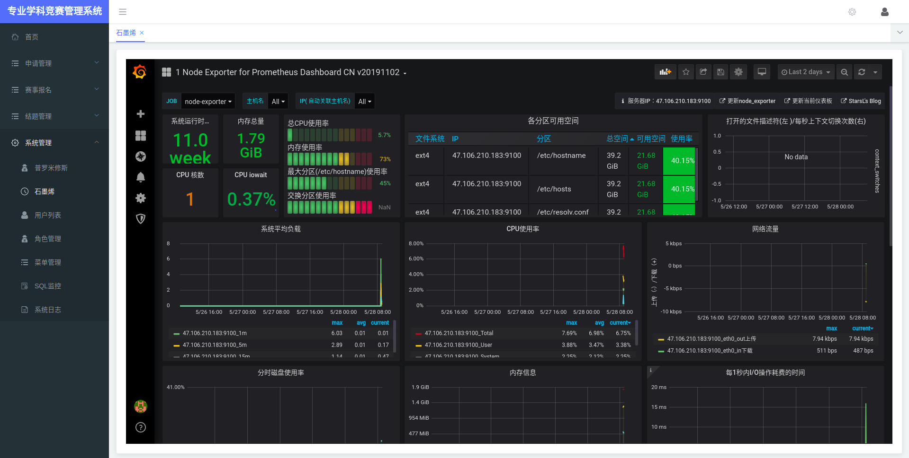

大学生专业学科竞赛项目过程管理系统  
 ============================  
## **项目说明**  

>大学生专业学科竞赛项目过程管理系统

## 业务功能

[业务功能](./BUSINESS.md)

## **构建项目**

1.运行命令:`mvn clean package`  
2.构建镜像:`docker build -t mikeyboom/pmsocspscs .`  
3.推送仓库:`docker push mikeyboom/pmsocspscs`  

## **部署项目**  

1.下拉项目:`git clone https://github.com/mikeygithub/pmsocspscs.git`  
2.打开项目:`cd pmsocspscs`  
3.授权脚本:`chomd +x run.sh`  
4.起飞项目:`./run.sh`   

## 技术要求

    
点击展开

    
   - 必选技术: (封顶70分)
    
    1开发技 术必须采用SpringBoot  
    2前端技 术采用Vue
    
   - 可选技术(加分项，每项10分，封顶30分)
    
    1数据库采用集群技术 [已采用]   
    2使用NaSQL技术 (非关系数据库，比如高速缓存，附件的管理) [已采用]   
    3使用RestFul服务 (分布式改造)[已采用]  
    4使用消息服务(构建第三方服务，并用消息中间件调用)  
    5应用健康监控(各层的性能监控) [已采用] 
    6应用微信小程序(结合Springboot/RestFul进行后台服务调用)  

## 技术架构

#### 后台

> springboot +  mybaits plus + druid + redis + mysql cluster + docker/docker-compose + shiro + swagger + travis-ci

#### 监控

> Prometheus + grafana + cadvisor + node-exporter

[看板中心](https://grafana.com/grafana/dashboards?orderBy=name&direction=asc)

#### 前端

> vue 全家桶 + ElementUI + axios

# 架构图

### 运行容器

### 登入系统

### 系统主页

### 普罗米修斯监控

### 数据源监控

### 石墨烯监控

